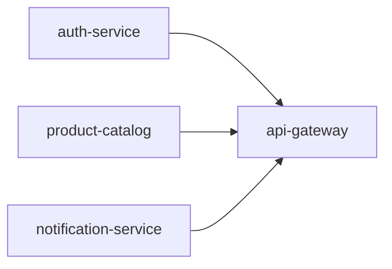

# Multi-Agent Execution Plan

## Project: E-Commerce Platform (4 Units)

## Cost-Benefit Assessment (MULTI-AGENT-08)

### Parallelizable Fraction

- **Total units**: 4
- **Independent units**: 3 (auth-service, product-catalog, notification-service)
- **Dependent units**: 1 (api-gateway depends on all three)
- **Estimated p**: 3/4 = 0.75

### Theoretical Speedup

With 3 parallel agents: `Speedup(3) = 1 / ((1-0.75) + 0.75/3) = 1 / (0.25 + 0.25) = 2.0x`

### Coordination Overhead Estimate

- Interface contract creation: ~15 min
- Merge + integration testing: ~20 min
- Total overhead: ~35 min
- Sequential time estimate: 4 × 45 min = 180 min
- Parallel time estimate: 45 min (longest unit) + 45 min (api-gateway) + 35 min (overhead) = 125 min

### Decision

**PARALLEL** — 2.0x theoretical, ~1.4x practical (125 min vs 180 min). Worth it for 3 independent services.

---

## Dependency Graph (MULTI-AGENT-02)



- **auth-service**: produces JWT validation middleware, user model
- **product-catalog**: produces product API, search interface
- **notification-service**: produces event publisher interface
- **api-gateway**: consumes all three service interfaces

**Parallelization**: Units A, B, C execute in parallel. Unit D executes after all complete.

---

## File Ownership (MULTI-AGENT-01)

| Unit | Owned Files | Agent |
|------|-------------|-------|
| auth-service | `src/auth/**`, `tests/auth/**`, `migrations/auth_*` | Agent 1 |
| product-catalog | `src/catalog/**`, `tests/catalog/**`, `migrations/catalog_*` | Agent 2 |
| notification-service | `src/notifications/**`, `tests/notifications/**` | Agent 3 |
| api-gateway | `src/gateway/**`, `tests/gateway/**`, `src/shared/routes.ts` | Agent 4 (after merge) |

**Shared files (deferred to api-gateway unit)**:
- `package.json` — api-gateway unit owns final dependency merge
- `docker-compose.yml` — api-gateway unit assembles final config
- `.env.example` — api-gateway unit consolidates all env vars

---

## Isolation Strategy (MULTI-AGENT-04)

**Strategy**: Feature branch per agent

| Agent | Branch | Merge Strategy |
|-------|--------|---------------|
| Agent 1 | `feat/auth-service` | Squash merge to `main` via PR |
| Agent 2 | `feat/product-catalog` | Squash merge to `main` via PR |
| Agent 3 | `feat/notification-service` | Squash merge to `main` via PR |
| Agent 4 | `feat/api-gateway` | Squash merge after Agents 1-3 merged |

No two agents write to the same branch. Merge conflict resolution: orchestrator (human) resolves during PR review.

---

## Timeout Policy (MULTI-AGENT-05)

| Unit | Estimated Time | Hard Timeout | Straggler Action |
|------|---------------|--------------|------------------|
| auth-service | 40 min | 90 min | Kill + reassign to Agent 4 |
| product-catalog | 45 min | 90 min | Kill + reassign to Agent 4 |
| notification-service | 30 min | 60 min | Kill + skip (non-critical for MVP) |
| api-gateway | 45 min | 90 min | Extend with justification |

**Progress checkpoints** (units > 30 min):
1. Design complete (10 min mark)
2. Code generated (25 min mark)
3. Tests passing (40 min mark)

---

## Shared State Policy (MULTI-AGENT-06)

- **No shared database during parallel execution** — each service uses its own test database
- **Read-only shared resources**: frozen interface contracts in `aidlc-docs/contracts/`
- **Audit log**: orchestrator writes to `aidlc-docs/audit.md` (not parallel agents)
- **Environment variables**: each agent reads from `.env.example` (read-only), does not modify

---

## Communication Protocol (MULTI-AGENT-09)

**Pattern**: Centralized orchestrator (human)

**Channels**:
- Agent → Orchestrator: PR status, completion signal (GitHub PR ready-for-review)
- Orchestrator → Agent: PR review comments, re-work requests
- Agent ↔ Agent: NONE (no direct communication)

**Message format**: Structured PR description with:
```
## Completion Status
- [ ] Design complete
- [ ] Code generated
- [ ] Tests passing (N/M)
- [ ] No lint errors

## Blocking Issues
- None / Description of blocker
```

**Orchestrator role**: Human developer — monitors PR status, triggers integration.

---

## Rollback and Recovery Plan (MULTI-AGENT-10)

**Isolation unit**: Each agent's feature branch is independently revertible.

| Failure Scenario | Recovery Action |
|------------------|----------------|
| Single unit fails | Retry on same branch; other units unaffected |
| Integration fails after merge | Revert failing unit's squash commit; others preserved |
| Straggler timeout | Kill agent; branch preserved for later retry or reassignment |
| All units fail | `git reset --hard` to pre-parallel state; retry sequentially |

**Key principle**: Successful units that pass integration are NEVER rolled back due to unrelated failures.
